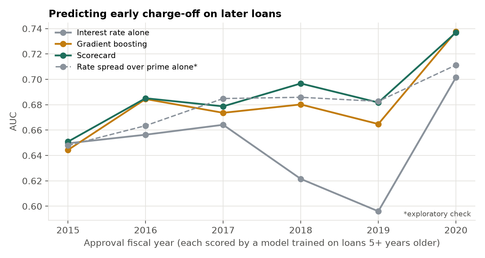
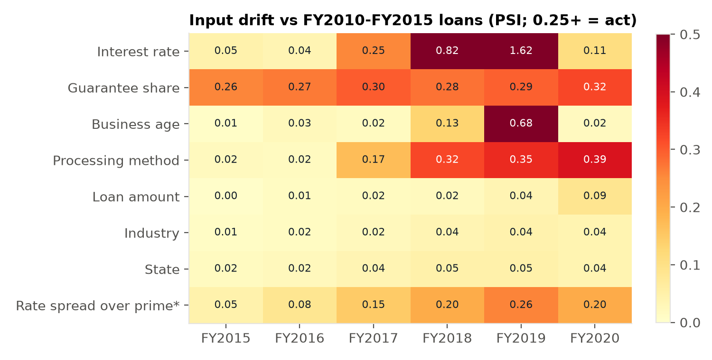
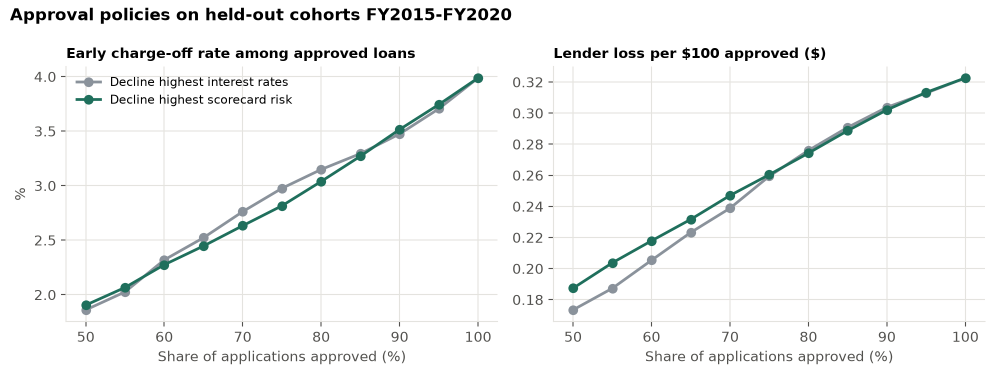
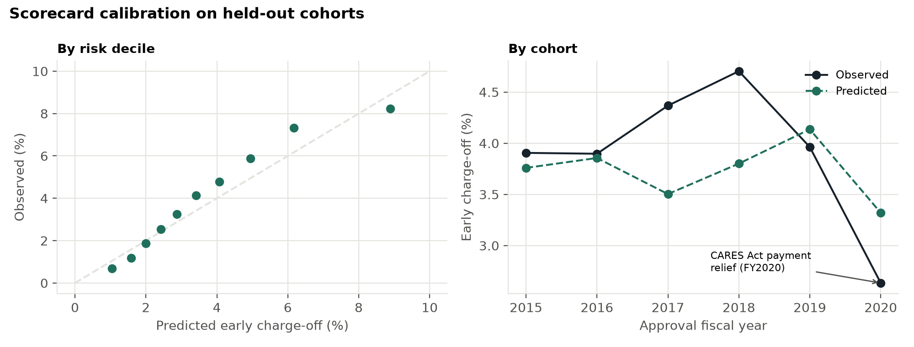
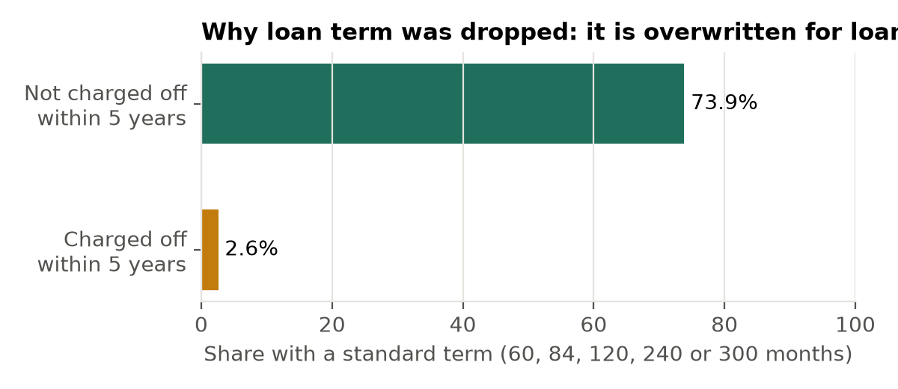

# Small-business loan default: a scorecard tested the way a lender would use it

[](https://github.com/Andresperez397/sba-loan-default-risk/actions/workflows/ci.yml)

Can a transparent credit scorecard predict which SBA 7(a) small-business loans will be charged off early, for loans approved *after* the model was built? And does it beat the lender's own price for risk, the interest rate?

The project follows the workflow of a bank's credit-risk and model-validation team:
- a data audit that caught an outcome leak
- out-of-time validation that respects what a lender could have known
- an approval-policy analysis in dollars
- the stability and segment checks a model-risk team runs.

The scorecard powers an R Shiny loan desk that shows a score, a default probability and the reasons behind it.

**Live app:** [andresperez397-sba-loan-default-risk.share.connect.posit.cloud](https://andresperez397-sba-loan-default-risk.share.connect.posit.cloud) · **Two-page summary:** [PDF](reports/Small-Business%20Loan%20Default%20-%20Summary.pdf)

**Data:** 514,984 disbursed SBA 7(a) loans approved FY2010–FY2020 (SBA loan-level FOIA data, public domain).
**Test cohorts:** FY2015–FY2020 (304,289 loans).
**Stack:** Python (DuckDB, scikit-learn, statsmodels) for the analysis; R Shiny for the app.

## Findings

**1. A model built on loans five years older still separates risk usefully, and a simple scorecard beats gradient boosting.**
Each test cohort was scored by a model trained only on loans approved at least five years earlier, because those are the only loans whose five-year outcomes a lender would know.

| Model | AUC (held-out cohorts) | 95% CI | KS |
|---|---|---|---|
| Interest rate alone | 0.632 | 0.628–0.637 | 0.23 |
| Gradient boosting | 0.677 | 0.672–0.681 | 0.26 |
| **Scorecard** (weight of evidence + logistic) | **0.684** | 0.680–0.689 | 0.28 |

- **Scorecard against boosting:** the scorecard beat gradient boosting by 0.0075 AUC (95% CI 0.004–0.011).
- **Why boosting lost:** boosting won the *within-training* cross-validation for every cohort, then lost on every later cohort. Flexible models learn era-specific patterns that don't survive a change in the economy, which is why validation has to be out of time.
- **Calibration:** the scorecard is well calibrated overall (recalibration slope 1.03).



**2. Most of the apparent edge over the interest rate was the prime rate moving.**
- **Against the absolute rate:** the scorecard beats the rate by 0.052 AUC.
- **What the stability check found:** the absolute rate is the least stable input. Its population stability index (PSI) reaches 1.62 in FY2019, against a 0.25 action threshold, because the prime rate rose from 3.25% to 5.50%.
- **Against the spread** (exploratory): a fairer benchmark is the rate's *spread over prime*, which is the lender's risk premium without the market rate level. On its own the spread reaches an AUC of 0.674. Against it, the scorecard's edge is **0.010 AUC** (95% CI 0.006–0.014): real, but modest.
- **Stability gain:** a scorecard built on the spread performs about the same overall, and its rate input drifts far less (PSI 0.26 instead of 1.62 in FY2019).



**3. In an approval policy, the scorecard's edge is in counts of defaults, not dollars.**
Compared on the same cohorts, these policies approve the safest share of applicants by scorecard risk or by interest rate.
- **Counts of defaults:** at 70–75% approval, the scorecard cuts early charge-offs from 2.76–2.98% to 2.63–2.82%.
- **Lender dollars:** the two policies are within two cents per $100 approved everywhere. Declining by rate is slightly *better* below 75% approval: $0.239 against $0.247 per $100 at 70%.
- **Why:** the scorecard predicts *whether* a loan defaults, not how many dollars are lost. It declines many small, risky loans, which matter less per dollar.
- **At the pre-specified 90% approval point** (decline the riskiest 10%), the two are effectively tied. The scorecard's early charge-off rate is 3.52% against 3.47% by rate. Lender loss is $0.302 against $0.304 per $100 approved; both differences are a fraction of a cent.
- **Next step:** a lender optimizing dollars would pair the default model with an exposure and loss model.



**4. Model-risk checks flag what a validator should escalate.**
- **Drift:**
  - interest rate (rising prime rate)
  - guarantee share (PSI 0.26–0.32 every year). The reference years include the Recovery Act's temporary 90% guarantees, which covered 38% of FY2010 and 22% of FY2011 loans, against under 1% from FY2012.
  - processing method (pilot programs ending)
  - business age in FY2019 (SBA's coding change).
- **Calibration by cohort:** FY2017–FY2018 are under-predicted. FY2020 is over-predicted (2.6% observed against 3.3% predicted), as the plan expected from the CARES Act payment relief.
- **Segments:**
  - Preferred-lender loans default 1.4 times more than predicted.
  - $500k+ loans default half as much as predicted.
  - Discrimination is weakest for small loans (AUC 0.62).



## The leak caught before any result was reported

The first pipeline check gave an AUC of 0.89 for the scorecard and 0.95 for boosting, far above what small-business credit models reach. The cause was **loan term**: SBA overwrites the term of loans that went bad.
- **The pattern:** 74% of loans that were not charged off carry a standard contractual term (60, 84, 120, 240 or 300 months). Only 2.6% of charged-off loans do; they show terms like 67 or 73 months.
- **How strong the leak is:** on its own, term separated defaults with an AUC of 0.86, while no other input exceeded 0.65.
- **Response:** term and the real-estate flag built from it were removed. A planned cleaning rule that filtered on term was also dropped, because it would have removed defaults. Both changes are in [DEVIATIONS.md](DEVIATIONS.md).



## How it was built

1. **Data audit first** ([DATA_AUDIT.md](DATA_AUDIT.md)).
   - **Outcome definition:** early charge-off is defined so that it is observed for every loan. Active loans' statuses are withheld, but an active loan has, by definition, not been charged off.
   - **Window:** it starts at FY2010 because interest rates are missing before FY2009.
   - **Recording changes:** SBA's business-age categories change in FY2018 and were harmonized.
   - **Privacy:** borrower names and addresses are never read.
2. **A frozen analysis plan** ([ANALYSIS_PLAN.md](ANALYSIS_PLAN.md)), committed before any model was fit. Changes and exploratory checks are logged in [DEVIATIONS.md](DEVIATIONS.md).
3. **Out-of-time validation:** test cohort FY *s* is trained on FY2010 through *s*−5. Uncertainty is a bootstrap of loans within each cohort (1,000 resamples), paired across models.
4. **The scorecard:**
   - quantile weight-of-evidence bins learned on training data, refit inside each cross-validation fold
   - L2 logistic regression
   - points scaled at 600 for 50:1 odds and 20 points to double the odds.

   A test checks that the points table reproduces the model's probabilities exactly. The app scores loans from that table.
5. **Engineering:**
   - DuckDB for the 1.6M-row source files
   - pinned requirements, with data pinned by SHA-256
   - `ruff` and 10 `pytest` tests (leakage, harmonization, held-out outcome corruption, points-to-probability reproduction, policy-curve logic). CI runs the lint and the 9 tests that don't need the raw data on every push.

## The app

| Tab | What it does |
|---|---|
| Loan desk | Enter a loan and get the score, the probability of early charge-off, the top reasons the score is not higher, and points by factor |
| Approval policy | Slide the approval rate and see early charge-offs and lender loss for scorecard against interest-rate declines |
| Model monitoring | AUC and calibration by cohort, PSI for every input, and performance by segment |

## Limitations

- **Early charge-offs only.** Charge-offs lag defaults, so a five-year window captures 52–60% of a cohort's charge-offs to date.
- **No real-estate indicator** after the term leak was removed, and no lender identity (the data only shows the current servicing bank).
- **No credit-bureau or financial-statement data** is public, so performance is far below what a lender with full underwriting data achieves. These results describe what public origination data can do.
- **Boosting was tuned on an 8-setting grid.** It usually chose the most conservative settings (15 leaves, 100–300 iterations), consistent with extra flexibility not paying off out of time.
- **The spread-over-prime check** was added after seeing results and is labelled exploratory.

## Reproduce

```bash
python -m venv .venv && .venv/bin/pip install -r requirements.txt
.venv/bin/python scripts/fetch_data.py      # SBA files (snapshot as of 2026-06-30) and FRED prime rate
.venv/bin/python scripts/data_audit.py
.venv/bin/python scripts/run_models.py      # about 70 minutes on 8 cores
.venv/bin/python scripts/run_spread.py
.venv/bin/python scripts/export_app.py
.venv/bin/python scripts/make_figures.py
.venv/bin/python -m pytest -q
Rscript -e "shiny::runApp('app')"
```

## Data and license

- **Data:** U.S. Small Business Administration 7(a) loan-level FOIA data (U.S. Government Works, public domain); prime rate from FRED (Federal Reserve Bank of St. Louis, series DPRIME).
- **What is committed:** raw data is not committed. Only aggregates and the scorecard's points table are.
- **Code:** MIT.
- **Affiliation:** not affiliated with or endorsed by the SBA.
